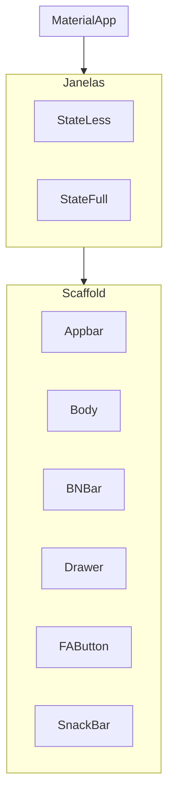

# 📘 Aula – 27/01/2026

## 📌 Conteúdo da Aula

No dia 27 de janeiro de 2026, realizamos as seguintes atividades:

## 🔧 Instalações
- Instalação e configuração do Git
- Conexão do Git com o GitHub
- Instalação do Visual Studio Code (VS Code)
- Integração do VS Code com o GitHub

## 📁 Organização do Projeto
Foi criada a estrutura inicial do projeto com a seguinte organização:

GabrielGomes/
├── Backend/
├── Frontend/
├── Projeto/
└── Mobile/
    └── README.md

# 03/02/2026
## Introdução ao Desenvolvimento Mobile

## Tipos de desenvolvimento 

- Nativo
    - Android:
        - SDK: Android SDK
        - IDE: Android Studio
        - Linguagens: Kotlin e Java
        - Ambientes: Mac, Win, Linux
    - IOS:
        - SDK: Cocoa Touch
        - IDE: Xcode
        - Linguegens: Swift / objecttype-C
        - Ambientes: Mac 

- Multiplataforma 
    - React Native:
        - SDK: Node.JS
        - IDE: VScode
        - Linguagens: JavaScript / TypeScript
        - Ambientes: Mac, Win, Linux  
    - Flutter:
        - SDK: Flutter SDK
        - IDE: VScode, Android Studio
        - Linguagens: Dart
        - Ambientes: Mac, Win, Linux

# 10/02/26

## Preparação do Ambiente de Desenvolvimento

### Instalação do FlutterSDK
- download do arquivo zip na página flutter.dev
- inclusão do flutter na pasta C:\src
- inclusão do flutter\bin nas variaveis de ambiente
- teste o flutter --version

### Instalação do AndroidSDK
- download do Android SDK - Command Line Tools
- adicionar o Command-Line ao c:\src\AndroidSDK
- adicionar o SDKManager as Variáveis de Ambiente
- download dos pacotes
    - emulador
    - platforms
    - platform-tools
    - build-tools

- adicionar ADB e o Emulator as Variáveis de Ambiente

- Criação da Imagem dop Emulator - via sdkmanager
- Build do Emulator - via sdkmanager

### Criação de Projetos e Códigos da Linha de Comando

-Criação de projetos
    - flutter create nome_do_app
        -flags:
            - --empty: Cria um alicativo "vazio"(hello world)
            - --platforms: permite a seleção de uma plataforma de desenvolvimento 
                - ex: --platforms=android (a criação do projeto será somente para plataforma android)
    - exemplo de criação de um aplicativo android vazio
        - flutter creaate nome_do_app --empty --platforms=android
        - obs: nome do aplicativo: todas as letras minúsculas, separação de palavras com "_";
    - flutter doctor
        - permite correção de pequenos problemas no flutter e identificação dos parametros funcionais em relação as plataformas de desenvolvimento
        - sempre rodar o flutter doctor no começo do desenvolvimento 
    - flutter clean
        - limpa o cache do build(apaga o apk anterior)
    - flutter run -v
        - build do app (apk)

- gerenciamento de dependeências do PubSpec()
    - intalação
        - flutter pub add nome_dependencias
    - baixar e instalar dependencias projetadas 
        - flutter pub get
    - outros comandos do flutter pu(dependencias)
        - flutter pub outdated (verifica se as dependencias estão desatualizadas)
        - flutter pub upgrade (atualiza as dependencias do flutter pub)

### Estrutura Básica de um Aplicativo em Flutter

#### Árvore de Widgets
